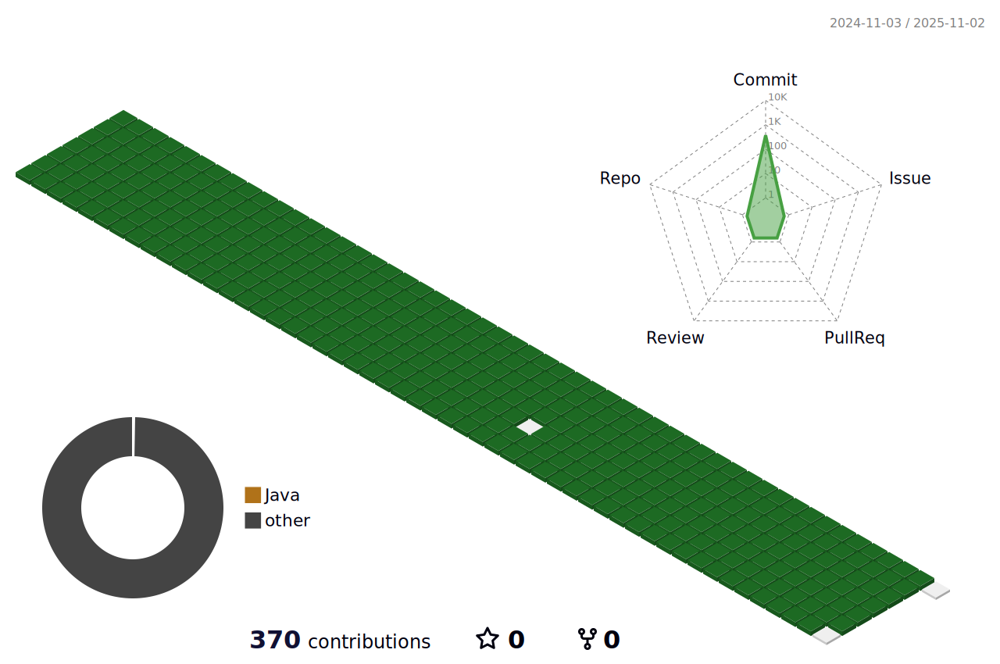

 

   

 

## 👋 백엔드 개발자 박소미입니다.  
기술을 꾸준히 공부하고 **지식을 공유**하며 **함께 성장**하는 삶을 지향합니다.  
새로 배운 **지식**부터 공유하고 싶은 **경험**까지 차곡차곡 **문서화**하고 있습니다.  
적절한 **아키텍쳐**를 선택하고 **TDD**를 기반으로 원활하게 프로젝트를 수행할 수 있는 개발자가 되겠습니다.  

  

### 🛠  Technical Skills
|분류|사용|
|:--:|:--:|
|프론트엔드|    |
|백엔드|     |
|테스팅|  |
|데이터베이스|     |
|클라우드|    |
|데브옵스|  |
|AI|  |
|협업|       |

  

### 🤝🏻 Link
   
  
  
  
  
### 💻  GitHub Analytics

  

